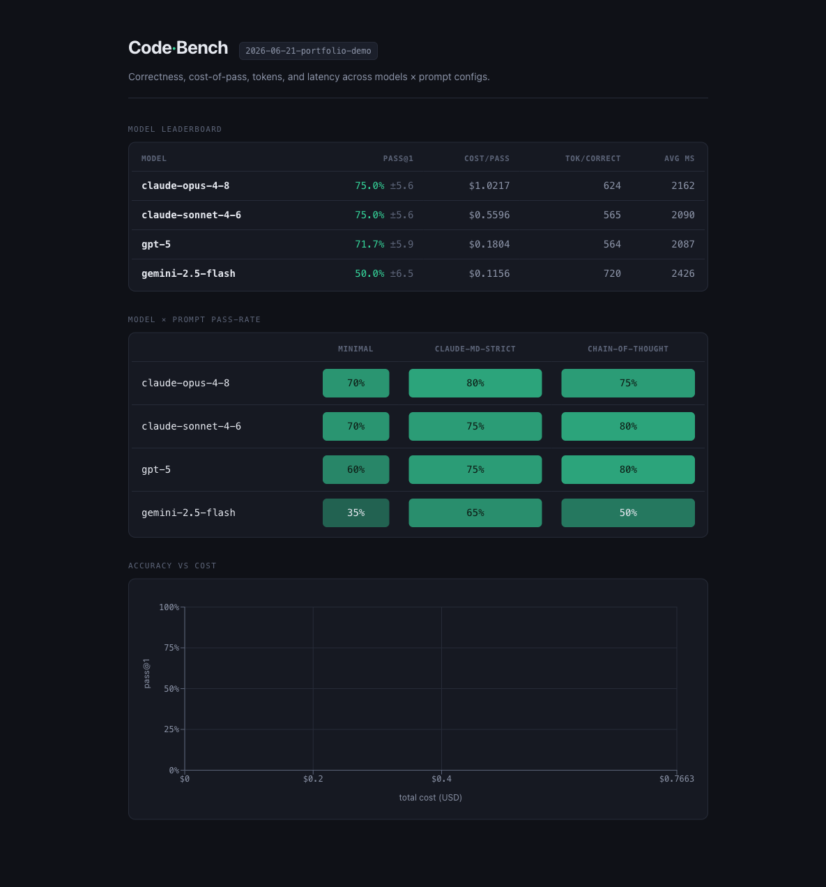

# CodeBench

A TypeScript benchmark harness that evaluates LLM coding ability across multiple providers **and** multiple prompt configurations — measuring not just correctness but the **cost, latency, and token efficiency** of every passing solution.



<sub>The leaderboard above is a demo run using the deterministic mock provider (so it reproduces with no API keys); every cell scores 100% at $0. A real provider run populates it with genuine pass rates and dollar costs.</sub>

---

## What it measures

Most benchmarks stop at pass@k. CodeBench adds the economic layer:

| Metric | Definition |
|---|---|
| **pass@k** | Unbiased Codex-paper estimator; headline is pass@1 with SEM across tasks |
| **cost-of-pass** | `totalCostUsd / passRate` — expected dollars to obtain one correct solution |
| **tokens-per-correct** | Token analogue of cost-of-pass; separates expensive models from verbose ones |
| **latency** | `ttftMs` (time to first token) and `totalMs`; latency-per-correct derived |

These four axes are computed for every cell in a **model × prompt-config matrix**, so you can answer "which prompt instruction style helps GPT-5 most?" alongside "which model is cheapest per correct answer?".

## Differentiators

**Cost-of-pass** — the metric that makes the leaderboard economically meaningful. A model that passes 80 % of tasks at \$0.01 each beats one that passes 90 % at \$0.10 each in nearly every real workload.

**Prompt-config A/B testing** — each run sweeps named `PromptConfig` objects (system prompt + temperature) across every model. The UI surfaces a model × prompt pass-rate matrix so you can see which instruction style wins for which model, not just which model wins overall.

**Unbiased pass@k + SEM** — the Codex-paper estimator avoids the upward bias of the naïve `c/n` ratio. Standard error of the mean surfaces statistical noise so you don't mistake a lucky run for a real improvement.

**Ports-and-adapters architecture** — each provider, executor, and extractor is a swappable adapter behind a shared interface. Adding a new model or sandbox requires touching exactly one file and registering one entry.

## Architecture

```
codebench/
├── packages/
│   ├── core/                 # pure domain — NO I/O, NO SDKs
│   │   ├── types/            # zod schemas for all data-model types
│   │   ├── scorer/           # passAtK, costOfPass, aggregation (pure)
│   │   ├── pricing/          # model→rate table + cost(), pricingVersion
│   │   └── interfaces/       # Provider, TaskLoader, Executor, Extractor (ports)
│   ├── providers/            # adapters: anthropic/ openai/ gemini/ ollama/ mock/ + registry
│   ├── executor/             # Docker (dockerode) + Subprocess impls
│   ├── extractor/            # layered code-fence extraction
│   ├── runner/               # orchestration; writes RunArtifact
│   ├── cli/                  # commander — run / report
│   └── web/                  # React + Vite — reads RunArtifact JSON only
├── tasks/                    # curated TS tasks (data)
├── prompts/                  # PromptConfig definitions
├── results/                  # run artifacts
└── docs/                     # spec, README, architecture diagram
```

**Dependency rule:** `core` imports nothing internal; everything else may import `core`; `web` imports only `@codebench/core`. Enforced by workspace boundaries and `eslint-plugin-import` (see `eslint.config.js`).

See [`docs/architecture.md`](docs/architecture.md) for the full ports-and-adapters explanation.

## Quickstart

```bash
git clone https://github.com/sachinp9797/codebench.git
cd codebench
pnpm install
```

### Run with the mock provider + subprocess executor (no keys, no Docker)

```bash
pnpm --filter @codebench/cli exec tsx src/cli.ts run \
  --models mock:m1 \
  --samples 1 \
  --executor subprocess
```

This runs the full pipeline — generation, extraction, execution, scoring — without any API keys or Docker daemon. Results land in `results/`.

### Run with a real provider + Docker sandbox

Build the sandbox image once:

```bash
./scripts/build-sandbox.sh
```

Set your API key, then run:

```bash
export ANTHROPIC_API_KEY=sk-ant-...
pnpm --filter @codebench/cli exec tsx src/cli.ts run \
  --models anthropic:claude-opus-4-8 \
  --executor docker
```

Other supported model IDs: `anthropic:claude-sonnet-4-6`, `anthropic:claude-haiku-4-5`, `openai:gpt-5`, `openai:gpt-5-mini`, `gemini:gemini-2.5-pro`, `gemini:gemini-2.5-flash`, `ollama:<local-model>`.

### View the UI

```bash
pnpm --filter @codebench/web run dev
```

Open http://localhost:5173. Load any `results/*.json` artifact to see the leaderboard (both pivots), model × prompt matrix, and accuracy-vs-cost chart.

## Model support and pricing

Pricing lives in a single table in [`packages/core/src/pricing.ts`](packages/core/src/pricing.ts), keyed by model id and stamped with a `pricingVersion` date. Every `RunArtifact` records the `pricingVersion` used so cost numbers stay reproducible when rates change.

| Provider | Model IDs |
|---|---|
| Anthropic | `claude-opus-4-8`, `claude-sonnet-4-6`, `claude-haiku-4-5` |
| OpenAI | `gpt-5.5`, `gpt-5.4`, `gpt-5`, `gpt-5-mini` |
| Google | `gemini-2.5-pro`, `gemini-2.5-flash` |
| Ollama | any locally-served model (prefixed `ollama:`, \$0 cost) |
| Mock | deterministic stub for CI (prefixed `mock:`, \$0 cost) |

## Sandbox safety

The Docker executor runs generated code with locked-down flags: `--network none`, read-only rootfs, non-root user, `CapDrop: ALL`, `no-new-privileges`, capped memory/CPU/pids, `--rm`, and a hard wall-clock timeout.

**Honest caveat:** Docker shares the host kernel — it is not a hardened isolation boundary for fully untrusted code. These flags significantly reduce the attack surface for typical benchmark code, but a kernel exploit bypasses them.

**One documented relaxation:** `tmpfs noexec` is intentionally absent. `tsx` (the TypeScript runner used inside the sandbox) uses `esbuild`, which extracts and exec-spawns a native binary at startup. `noexec` on `/tmp` prevents that. The planned fix is to pre-warm esbuild into the sandbox image so the native binary is already present at a known path, restoring `noexec`. Until then, `noexec` is off.

**Hardening upgrade path:** pass `runtime: "runsc"` in `DockerExecutorOptions` to use gVisor's kernel-intercepting runtime. gVisor provides true kernel-level isolation at the cost of some syscall overhead. See the [gVisor documentation](https://gvisor.dev/docs/) for installation.

## Known limitations

1. **Refactor tasks can't be graded honestly.** A correctness-only harness can't distinguish code that was genuinely refactored from code that simply copies the original prompt. Refactor tasks are included for coverage but their scores are a lower bound on quality, not a measure of it.

2. **`ttftMs` equals `totalMs` on non-streaming providers.** Time-to-first-token is only meaningful with streaming. Providers that return a complete response in one shot (all current adapters) report `ttftMs = totalMs`. Streaming support is the precondition for a real TTFT signal.

3. **Scores are not directly comparable to HumanEval or SWE-bench.** This benchmark uses original, hand-authored tasks. Numbers cannot be mapped to published leaderboard scores. Tasks are date-stamped (`releaseDate`) to enable temporal contamination filtering — you can exclude tasks released before a model's training cutoff.

## CI

GitHub Actions runs `pnpm typecheck && pnpm lint && pnpm test` on every push and pull request using the mock provider + subprocess executor — no API keys or Docker daemon required. See [`.github/workflows/ci.yml`](.github/workflows/ci.yml).

## Tech stack

TypeScript · Node 20+ · pnpm 10 workspaces · `commander` (CLI) · `zod` (schema validation) · `dockerode` (sandbox) · `@anthropic-ai/sdk` / `openai` / `@google/genai` (providers) · React + Vite + Recharts (UI) · Vitest (tests) · ESLint 9 flat config (lint)

## License

MIT — see [`LICENSE`](LICENSE).
